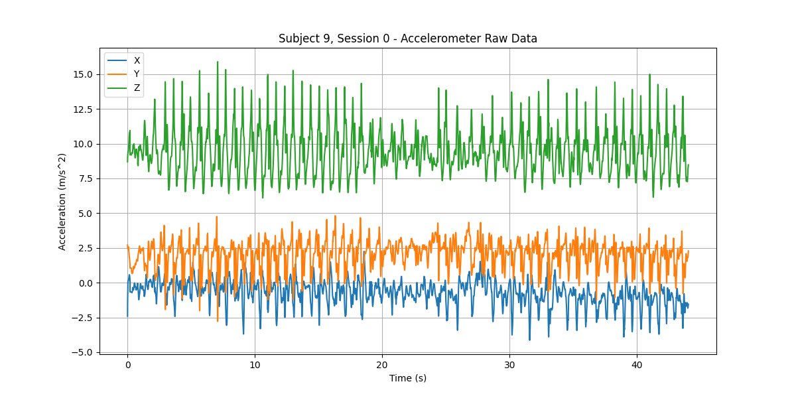
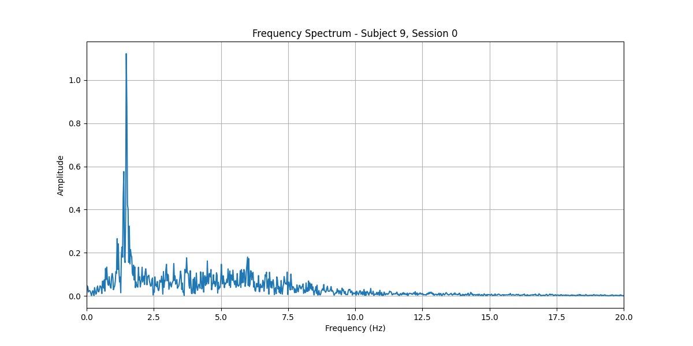
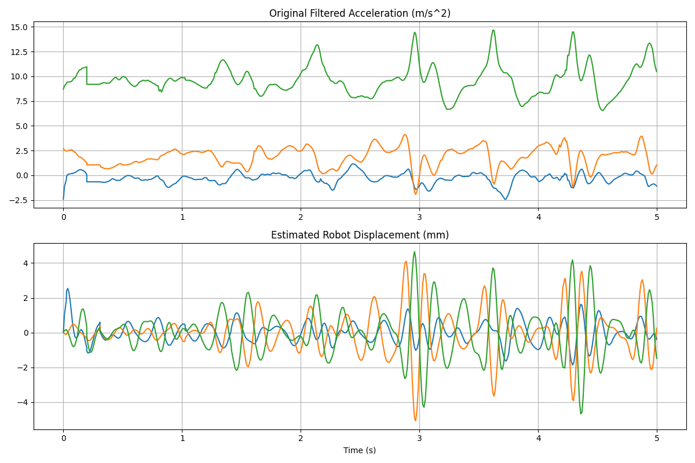

# Tremor Emulator: Parkinson's Disease Replication on xArm 5

This project implements a high-fidelity tremor emulator that uses real-world accelerometry data from Parkinson's Disease (PD) patients to drive a UFACTORY xArm 5 robotic arm. It is designed to test assistive devices, such as eye droppers and feeding utensils, under standardized yet realistic pathological motion conditions.


### Status:
1.  **Clinical Data Integration**: Extracted and processedthe Zenodo PD dataset, identifying a strong 6.2 Hz postural tremor.
2.  **Advanced Signal Processing**: Implemented a 5th-order Butterworth bandpass filter (3-10 Hz) to isolate pathological tremors from voluntary movement and noise.
3.  **High-Fidelity Simulation**: Created a MuJoCo 3.4.0 environment with exact mass and inertia tensors (sourced from UFACTORY `HT_BR2` hardware specs) to ensure stability during high-frequency jitter.
4.  **Robot/Gripper URDF Notes**: 
    *   **Gripper Orientation**: Correct mounting requires a **180-degree rotation around the Z-axis** (`quat="0 0 0 1"`) to prevent motor block collisions.
    *   **Collision Suppression**: Zero-offset mounting is enabled by ignoring collisions between the tool assembly and the robot wrist.
    
## Data Exploration

The following visualizations from our analysis notebooks illustrate the tremor characteristics:

### 1. Raw Session Data
A sample 10-second segment of Subject 9's accelerometry data showing the characteristic periodic oscillation.


### 2. Frequency Analysis (FFT)
Power Spectral Density (PSD) analysis reveals a sharp peak at ~6.2 Hz, consistent with classic Parkinsonian postural tremor.


### 3. Filtered Motion Replay
The result of our displacement estimation algorithm after applying the Butterworth filter, showing the isolated jitter used to drive the robot.


## Signal Processing Pipeline

The tremor isolation logic follows this mathematical path:

1.  **Bandpass Filtering**:
    Isolates the tremor from static gravity (0 Hz) and high-frequency sensor noise.
    
2.  **Displacement Estimation**:
    Since we only have acceleration, we perform double integration with high-pass filtering to estimate local displacement.

## Simulation Setup

The MuJoCo simulation leverages official URDF/STL parameters to prevent "NaN" physics errors that typically occur when applying high-frequency forces to primitive shapes with inaccurate inertia.

- **Integrator**: RK4 (Runge-Kutta 4th Order)
- **Timestep**: 0.001s (1000 Hz)
- **Scale Factor**: 0.004 results in 1:1 clinical replication (1g ≈ 4mm peak-to-peak).
- **Physics Stability**: Achieved via high joint damping, armature, and linear interpolation between 100Hz control samples.

## Dataset Handling
The full dataset (Subjects 1-11) is ~3.7GB and is excluded from this repository to maintain performance. 
- **Source**: Parkinson's Disease IMU Data (Accelerometer signals).
- **Setup**: 
  1. Download the raw data (PD_IMU_Data.zip).
  2. Place it in `data/raw/`.
  3. Run `python src/data_processing/clean_data.py` to generate the processed pickle files.
  4. See `scripts/download_data.py` for automated setup notes.

## Replication Guide

### Prerequisites
- Python 3.10+
- MuJoCo 3.4+
- `numpy`, `scipy`, `mujoco-python-viewer`

### Installation
1. Clone the repository.
2. Install dependencies:
   ```bash
   pip install -r requirements.txt
   ```
3. Run the GUI launcher:
   ```bash
   python src/gui/deployment_gui.py
   ```
4. Or run the simulation directly:
   ```bash
   python src/simulation/run_simulation.py [subject_id]
   ```

## Folder Structure
- `data/`: Contains `imu_data.pkl` (processed patient data)
- `src/data_processing/`: Butterworth filtering and displacement logic
- `src/simulation/`: MuJoCo MJCF model and simulation loop
- `src/gui/`: Tkinter-based control application
- `src/robot_control/`: xArm 5 SDK integration and hardware bridge

## Hardware Deployment Plan

We are currently transitioning from simulation to the physical xArm 5. The deployment logic focuses on safety and standardized "Ready" positions for medical device testing.

### GUI Development
A simple GUI is being developed to:
- Home the robot.
- Transition to the "Testing Stance".
- Toggle tremor replication on/off.
- Select between the **Eye Dropper** and **Feeding Spoon** scenarios.
